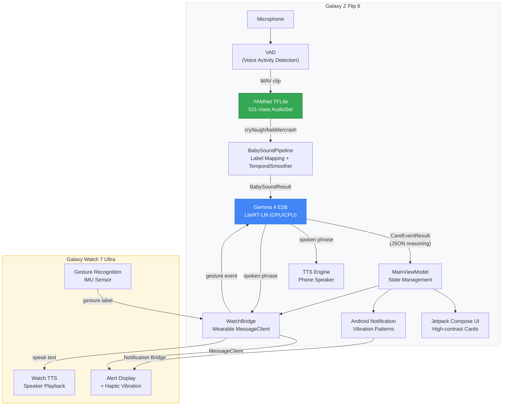
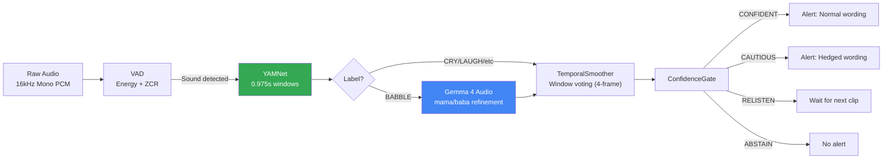
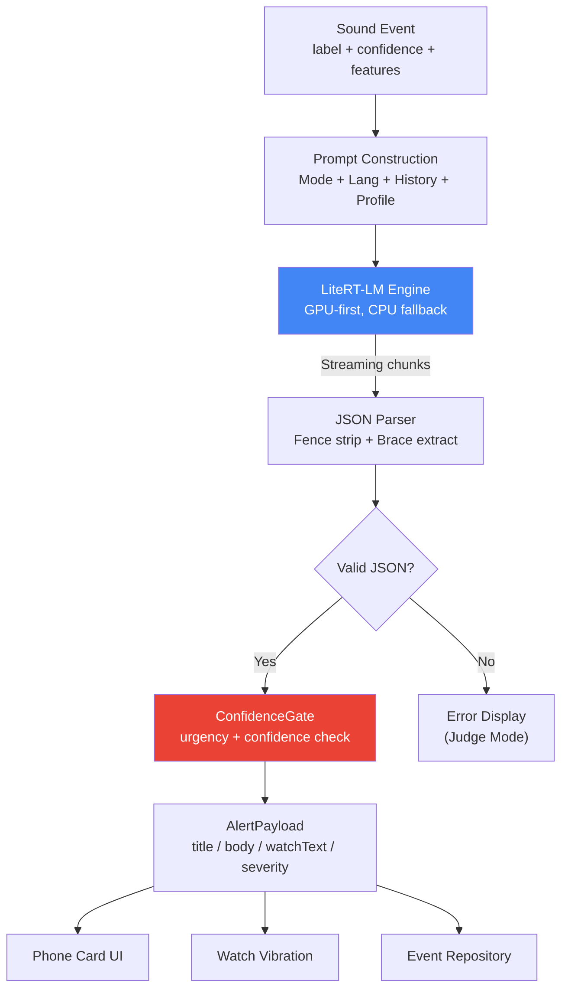
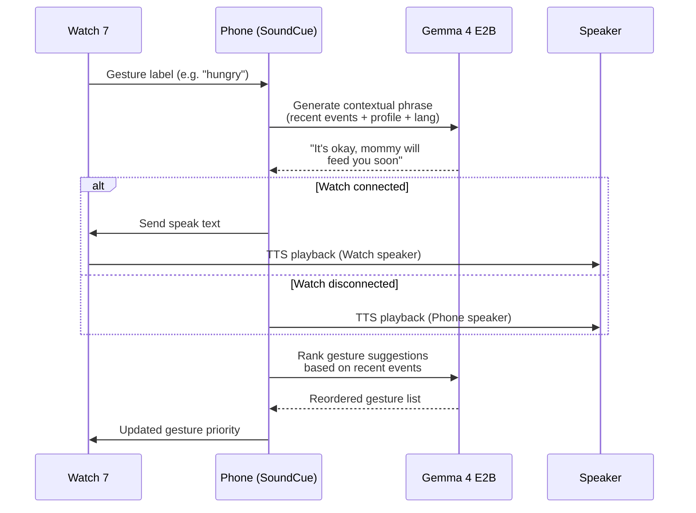
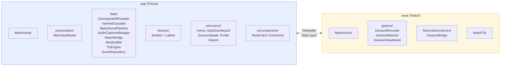
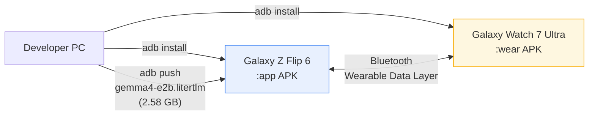

# SoundCue Architecture

## System Overview

```mermaid
graph TB
    subgraph Phone["Galaxy Z Flip 6"]
        MIC["Microphone"]
        VAD["VAD<br/>(Voice Activity Detection)"]
        YAMNET["YAMNet TFLite<br/>521-class AudioSet"]
        PIPELINE["BabySoundPipeline<br/>Label Mapping + TemporalSmoother"]
        GEMMA["Gemma 4 E2B<br/>LiteRT-LM (GPU/CPU)"]
        VM["MainViewModel<br/>State Management"]
        UI["Jetpack Compose UI<br/>High-contrast Cards"]
        NOTIF["Android Notification<br/>Vibration Patterns"]
        TTS["TTS Engine<br/>Phone Speaker"]
        BRIDGE["WatchBridge<br/>Wearable MessageClient"]
    end

    subgraph Watch["Galaxy Watch 7 Ultra"]
        WALERT["Alert Display<br/>+ Haptic Vibration"]
        GESTURE["Gesture Recognition<br/>IMU Sensor"]
        WTTS["Watch TTS<br/>Speaker Playback"]
    end

    MIC --> VAD
    VAD -->|"WAV clip"| YAMNET
    YAMNET -->|"cry/laugh/babble/crash"| PIPELINE
    PIPELINE -->|"BabySoundResult"| GEMMA
    GEMMA -->|"CareEventResult<br/>(JSON reasoning)"| VM
    VM --> UI
    VM --> NOTIF
    NOTIF -->|"Notification Bridge"| WALERT
    VM --> BRIDGE
    BRIDGE -->|"MessageClient"| WALERT
    GESTURE -->|"gesture label"| BRIDGE
    BRIDGE -->|"gesture event"| GEMMA
    GEMMA -->|"spoken phrase"| TTS
    GEMMA -->|"spoken phrase"| BRIDGE
    BRIDGE -->|"speak text"| WTTS

    style GEMMA fill:#4285F4,color:#fff,stroke:#1a73e8
    style YAMNET fill:#34A853,color:#fff,stroke:#0d652d
    style Phone fill:#f8f9fa,stroke:#dadce0
    style Watch fill:#fef7e0,stroke:#f9ab00
```

## Audio Classification Pipeline

```mermaid
flowchart LR
    A["Raw Audio<br/>16kHz Mono PCM"] --> B["VAD<br/>Energy + ZCR"]
    B -->|"Sound detected"| C["YAMNet<br/>0.975s windows"]
    C --> D{"Label?"}
    D -->|"BABBLE"| E["Gemma 4 Audio<br/>mama/baba refinement"]
    D -->|"CRY/LAUGH/etc"| F["TemporalSmoother<br/>Window voting (4-frame)"]
    E --> F
    F --> G["ConfidenceGate"]
    G -->|"CONFIDENT"| H["Alert: Normal wording"]
    G -->|"CAUTIOUS"| I["Alert: Hedged wording"]
    G -->|"RELISTEN"| J["Wait for next clip"]
    G -->|"ABSTAIN"| K["No alert"]

    style C fill:#34A853,color:#fff
    style E fill:#4285F4,color:#fff
```

## Gemma 4 E2B Reasoning Flow

```mermaid
flowchart TB
    INPUT["Sound Event<br/>label + confidence + features"] --> PROMPT["Prompt Construction<br/>Mode + Lang + History + Profile"]
    PROMPT --> ENGINE["LiteRT-LM Engine<br/>GPU-first, CPU fallback"]
    ENGINE -->|"Streaming chunks"| PARSE["JSON Parser<br/>Fence strip + Brace extract"]
    PARSE --> VALIDATE{"Valid JSON?"}
    VALIDATE -->|"Yes"| GATE["ConfidenceGate<br/>urgency + confidence check"]
    VALIDATE -->|"No"| ERROR["Error Display<br/>(Judge Mode)"]
    GATE --> OUTPUT["AlertPayload<br/>title / body / watchText / severity"]
    OUTPUT --> PHONE_UI["Phone Card UI"]
    OUTPUT --> WATCH_ALERT["Watch Vibration"]
    OUTPUT --> LOG["Event Repository"]

    style ENGINE fill:#4285F4,color:#fff
    style GATE fill:#EA4335,color:#fff
```

## Gesture-to-Speech Flow

```mermaid
sequenceDiagram
    participant W as Watch 7
    participant P as Phone (SoundCue)
    participant G as Gemma 4 E2B
    participant S as Speaker

    W->>P: Gesture label (e.g. "hungry")
    P->>G: Generate contextual phrase<br/>(recent events + profile + lang)
    G-->>P: "It's okay, mommy will<br/>feed you soon"
    alt Watch connected
        P->>W: Send speak text
        W->>S: TTS playback (Watch speaker)
    else Watch disconnected
        P->>S: TTS playback (Phone speaker)
    end
    P->>G: Rank gesture suggestions<br/>based on recent events
    G-->>P: Reordered gesture list
    P->>W: Updated gesture priority
```

## Module Structure

```mermaid
graph LR
    subgraph app[":app (Phone)"]
        direction TB
        MA[MainActivity]
        VM2[presentation/<br/>MainViewModel]
        DATA[data/<br/>GemmaLiteRtProvider<br/>YamNetClassifier<br/>BabySoundPipeline<br/>AudioCaptureManager<br/>WatchBridge<br/>AlertNotifier<br/>TtsEngine<br/>EventRepository]
        DOMAIN[domain/<br/>Models + Labels]
        SCREENS[ui/screens/<br/>Home, BabyDashboard<br/>GestureSpeak, Profile<br/>Report]
        COMP[ui/components/<br/>ModeCard, EventCard]
    end

    subgraph wear[":wear (Watch)"]
        direction TB
        WMA[MainActivity]
        WGESTURE[gesture/<br/>GestureRecorder<br/>GestureMatcher<br/>GestureViewModel]
        WSERVICE[AlertListenerService<br/>GestureBridge]
        WTTS2[WatchTts]
    end

    app <-->|"Wearable<br/>Data Layer"| wear

    style app fill:#e8f0fe,stroke:#4285F4
    style wear fill:#fef7e0,stroke:#f9ab00
```

## Device Deployment

```mermaid
graph LR
    DEV["Developer PC"] -->|"adb install"| FLIP["Galaxy Z Flip 6<br/>:app APK"]
    DEV -->|"adb install"| WATCH["Galaxy Watch 7 Ultra<br/>:wear APK"]
    DEV -->|"adb push<br/>gemma4-e2b.litertlm<br/>(2.58 GB)"| FLIP
    FLIP <-->|"Bluetooth<br/>Wearable Data Layer"| WATCH

    style FLIP fill:#e8f0fe,stroke:#4285F4
    style WATCH fill:#fef7e0,stroke:#f9ab00
```
